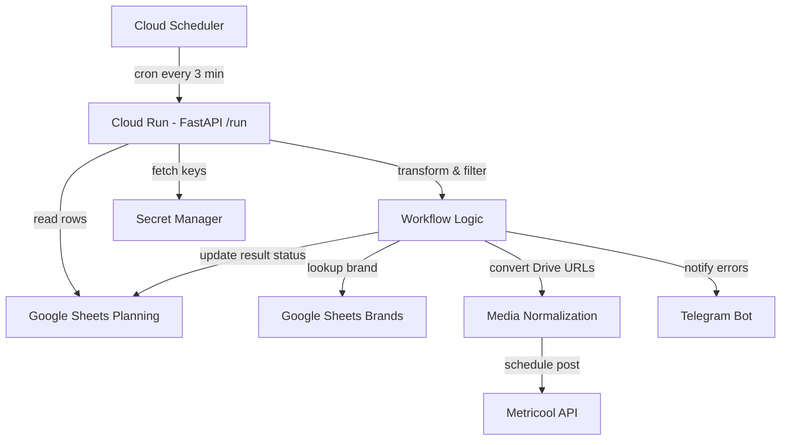

# Arquitectura de la Solución: Metricool Publisher en GCP

## 1. Contexto y Objetivos
Sustituir el flujo original de n8n por una aplicación Python robusta alojada en Google Cloud Platform (GCP). Los objetivos principales son:
- **Modularidad**: Código reutilizable y testable.
- **Seguridad**: Gestión de secretos profesional (Secret Manager).
- **Mantenibilidad**: Logging centralizado y alertas vía Telegram.

## 2. Diagrama Conceptual (Mermaid)

## 3. Flujo de Datos Detallado
1. **Trigger**: `Cloud Scheduler` llama al endpoint HTTP expuesto por `Cloud Run`.
2. **Ingesta**: `GoogleSheetsService` lee el rango completo de la hoja `planificacion_data`.
3. **Procesado**:
    - Se filtran los registros que tengan redes activas (`TRUE`) y no hayan sido procesados (`no Publicado en Metricool`).
    - Se valida que la fecha de publicación sea futura (UTC-3 Argentina).
4. **Integración**:
    - Para cada registro, se busca su `blogId` en la hoja de marcas.
    - Se normalizan las URLs de archivos multimedia.
    - Se realiza la llamada POST a la API de Metricool.
5. **Cierre**: Se actualiza la hoja de cálculo con el estado de éxito o error y el ID devuelto por Metricool.

## 4. Gestión de Secretos (Secret Manager)
Utilizamos nombres estandarizados de secretos:
- `METRICOOL_API_KEY`: Token de autenticación (`X-Mc-Auth`).
- `METRICOOL_USER_ID`: Identificador del usuario.
- `TELEGRAM_BOT_TOKEN`: Token para interactuar con la API de Telegram.

## 5. Estrategia de Monitoreo
Todas las operaciones críticas se registran mediante `google-cloud-logging`. Los errores graves (fallos de API) disparan una notificación inmediata al canal de Telegram configurado.
